# **Introduction**

Thank you for downloading the ShinyFMBN app. The app was created using [R](https://cran.r-project.org/) and [Shiny](https://shiny.rstudio.com/) and is currently designed to run locally on your machine. The app will allow you to

1. explore studies^[a set of samples in a published or unpublished study] and samples^[a sample in a study, either a food or a food environment sample] in FoodMicrobionet using the **Explore tab**.  

2. select a subset of samples using a combination of filters with the **Filter tab.**  

3. (optionally) aggregate samples or taxa with the **Aggregate tab.**  

4. export the data in a variety of formats and visualize them in tables and plots^[by default the app saves 7x5 inches plot in jpeg format, 150 dpi. This can be changed by changing the code of the app (options)] with the **Export tab**.  

5. access external resources (SRA/ENA, NCBI Taxonomy, LPSN, **Omnicrobe** (formerly Florilege))  

**This version allows access to data for Bacteria and Fungi**: use the drop-down menu in the Welcome tab to select the version you want to explore.  

A few other options can be set in lines 45-78 of the app (the *Options* section).  

## What's new.  

I made a few improvemets since version 2.5:

* The selection of the database is now possible using a dropdown in the Welcome tab  

* Filtering is now performed using studies, L1 and L6 (the latter is identical to using foodId but easier to interpret)  

* the option of saving files for the conet app of Cytoscape has been removed: inference of association networks can be performed more efficiently using a phyloseq object with the [NetCoMi](https://github.com/stefpeschel/NetCoMi) package.  

* A few additional options for saving graphs can be set in the Save options tab.

# **Requisites**.

To run the app you need R version 4 or above (download from [CRAN](https://cran.r-project.org/)) and [RStudio](https://www.rstudio.com/products/rstudio/download/#download). Make sure that the software can be run with your system. Please note that the app will display large tables: you will be better off if you use a large display (21.5 inches or larger). Using smaller displays is feasible but may require some horizontal and vertical scrolling.

# **Launching the app.**

The app includes the code for installing a number of R packages, including Shiny. However, you may want to install and load Shiny before running the app for the first time. If you are not familiar with R or RStudio, the easiest way is to use the Install; button of the File tab of the Plots pane (the pane on the lower right of your screen).

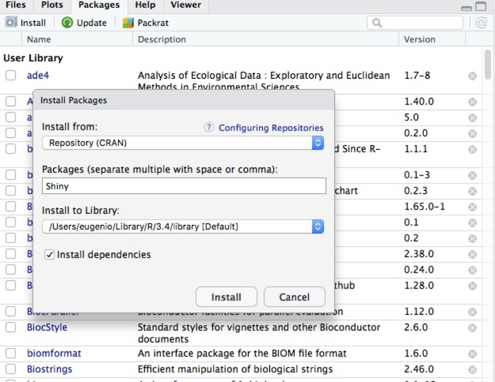

Otherwise, just type in the R console

```
>install.packages("shiny")

>library("shiny")
```

There are several ways to launch the app (for more info and options visit this page: [https://shiny.rstudio.com/articles/running.html](https://shiny.rstudio.com/articles/running.html)):

**A. use the runShinyFMBN script.**

This is probably the best way to run the app when you use it for the first time, because you will be able to check that all the packages are installed correctly. The script will perform all needed installations and launch the app for you.

1. set the working directory to the folder containing the app folder (look [here](https://support.rstudio.com/hc/en-us/articles/200711843-Working-Directories-and-Workspaces) for instructions)  

2. open the script (in RStudio use the File--Open file menu)

3. run the script using the Run or Run app command in the header bar of the script

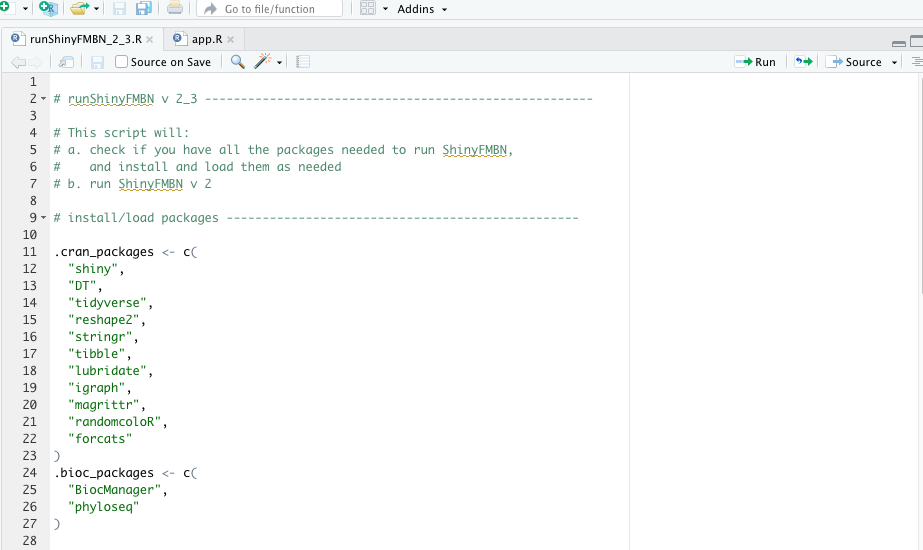

**B. launching the app from the console**

1. set the working directory to the folder containing the app folder (can be omitted, look [here](https://support.rstudio.com/hc/en-us/articles/200711843-Working-Directories-and-Workspaces) for instructions)

2. at the R console type^[otherwise use `runApp(ShinyFMBN_3, launch.browser = T)` to launch the app in your default browser or `runApp(ShinyFMBN_3;, launch.browser = T, display.mode = "showcase")` to do the same in showcase mode]

```
>runApp("ShinyFMBN_3")
```

3. the app will open by default in a new window in RStudio

4. to get help on runApp() at the R console type

```
>help("runApp")
```

**C. launching the app from the source pane**

1. use the File--Open menu to open the app (you may have to navigate to the app folder if it is not in your working directory)

2. use the Run App button to run the app (if you want you can select the run mode)

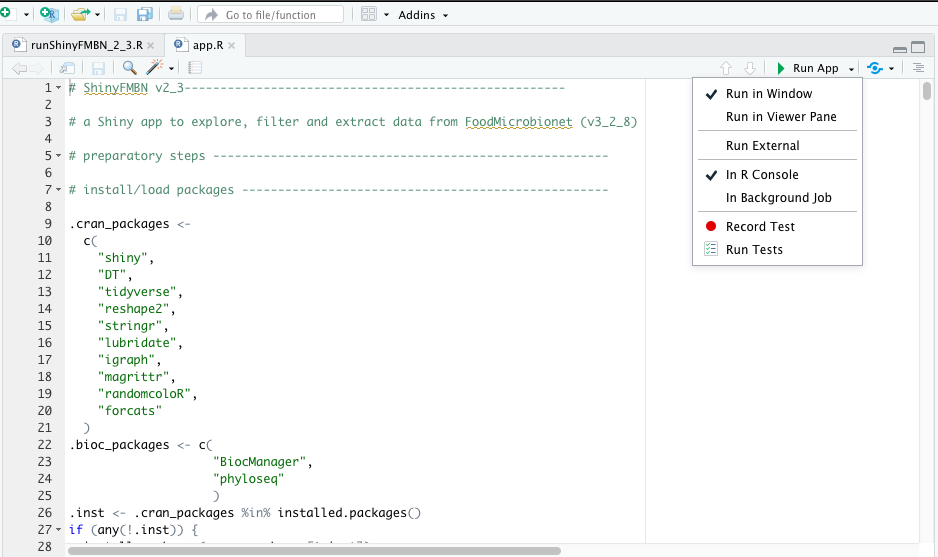

**Please remember** : when you run the app the R session will be busy. There are several ways to terminate the app (see the RStudio article on running an app). The easiest is probably clicking the red stop button in the console.

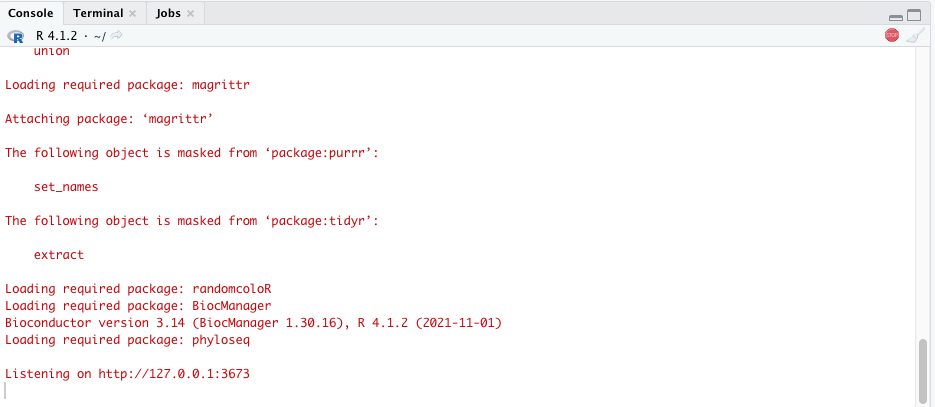


# **Using the app**.

The use of the app is quite straightforward and instructions are provided in each pane. The app is self-contained:

1. FoodMicrobionet data are in the /data subfolder: do not alter or move this folder or the data files;  

2. external, static images are in the /www subfolder: do not alter or move this folder;  

3. files will be saved in subfolders in the /output subfolder: see the Export tab for further details. 

## **The Welcome tab**.

The Welcome tab let's you choose which version of the database will be used (Bacteria or Fungi): just pick one from the drop-down menu and a few statistics will appear.  

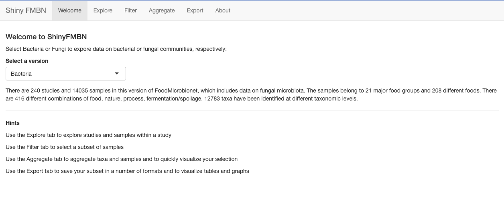


## **The Explore tab**.

The Explore tab lets you explore studies and samples in FoodMicrobionet, as a preliminary step before filtering.

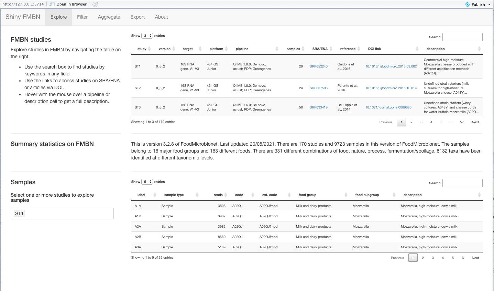

On the right of your display you will find:

1. **a table with information on studies** included in FoodMicrobionet^[A pipeline field is now available in the studies table; it includes the bioinformatic software used for analysis, the OTU picking strategy (or ASV with dada2 if ASV were inferred instead), the assign taxonomy method and the taxonomic database]; in this and other tables in the app you can:  

    + use the **Show** menu to select the number of entries to be shown  
    
    + use the **Search** box to enter text and show records which include the text in any of the fields  
    
    + reorder the records by clicking on the headings of each field  
    
    + use hyperlinks to access external information (here you can access the sequences on SRA/ENA^[ShinyFMBN 2 will direct you to the run selector] or the papers using the DOI link)  

    + use the navigation menu at the bottom to show other records  

3. **a table with samples in one or more studies** (use the drop-down menu on the left to select or remove studies)  

**Please note** that selections made in the Explore tab do not have any effect on subsequent filtering.

## **The Filter tab**.

This tab allows you to select a subset of samples for further analysis. Initially, all samples are shown and the selection can be narrowed down using different approaches.  

1. use the drop-down menus (studies, food groups (L1 level in FoodEx2 classification), foods (L6 level in FoodEx2^[unfortunately, there is no practical way to add food codes AND their description; use the table in the Filter or Explore tab as a guidance]) to select studies, then food groups and then food codes); check or uncheck the **apply** check boxes to apply/remove your selection. As you proceed, the table on the right will be updated;  

2. lists in the drop-downs are created dynamically, but, because of the hierarchic nature of fields in FoodMicrobionet, if you want to start your selection using food groups (or food codes) you should leave the study selection empty (or uncheck the apply check box);  

3. once you are done, you can narrow your search using the filters at the bottom of the table^[some filters will be inactive, depending of the context]: sample type (Environment for environmental samples, Sample for food samples), number of reads (use the slider to filter out samples with a low number of sequences after clean up; however, this can be easily done at a later stage), nature, process or spoilage. Please note that the options in the filters are updated every time you make a selection using the drop-down menus on the right or the filters at the bottom of the table, so not all options might be available as you proceed with the selection. **Be aware** that to remove a filter from a column you have to delete the option you have selected manually, while for the drop-down menus you can quickly remove all selections by unchecking the apply boxes.  

**You should use at least one of the filters before you move to the Aggregate and Export tabs**^[if you don't, you will get an error in the Aggregate tab]


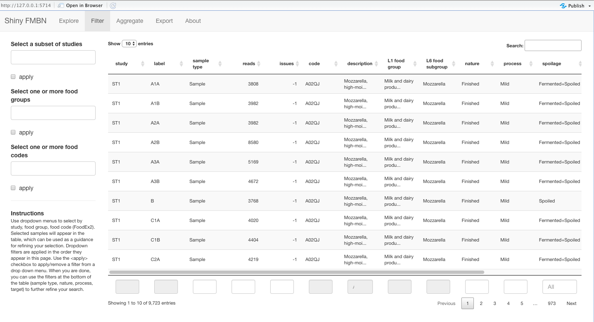

## **The Aggregate tab.**

The aggregate tab will display all the relevant tables from FoodMicrobionet after the application of your filters^[if you do not use any filter and tick at least the **apply** checkbox for selecting studies, all studies, samples and taxa will be shown but, because of the size of the matrices (more than 3x10^6^ elements) that are created, the app may freeze for several minutes.].

On the right of the screen you will find:

1. summary information on your selection.  

2. the studies which include the samples in your selection.  

3. samples in your selection (the table will be affected by the Show drop-down menu, see below).  

4. taxa in your selection: taxa are shown at different taxonomic levels and reflect the original taxonomic annotation of OTUs (or pooled ASVs in most recent versions^[effective from version 3.1 of FoodMicrobionet new studies are added by processing raw sequences downloaded from NCBI SRA using a pipeline based on DADA2. The pipeline infers Amplicon Sequences Variants, but ASVs with the same taxonomic annotation are pooled before they are imported in FoodMicrobionet]) of the studies included in FoodMicrobionet. Therefore, higher taxa (for example _Enterobacteriaceae_) indicate OTUs/ASVs for which annotation was not possible below the family level. The table will be affected by the Show drop-down menu, see below. The relative abundance is calculated on the fly and corresponds to the relative abundance of the taxa in your selection (and not in individual samples). By default, the table is ordered by descending abundance, but you can reorder the table if you so wish (see instructions for the Explore tab). Hyperlinks to external resources (NCBI taxonomy, the List of Prokaryotic Names with Standing in Nomenclature, and the Omnicrobe database^[[see here](https://omnicrobe.migale.inrae.fr/index); links are only provided for searches at the species, genus or family level] are provided for convenience.  
 
5. a convenience list of references (this will be exported with your data)

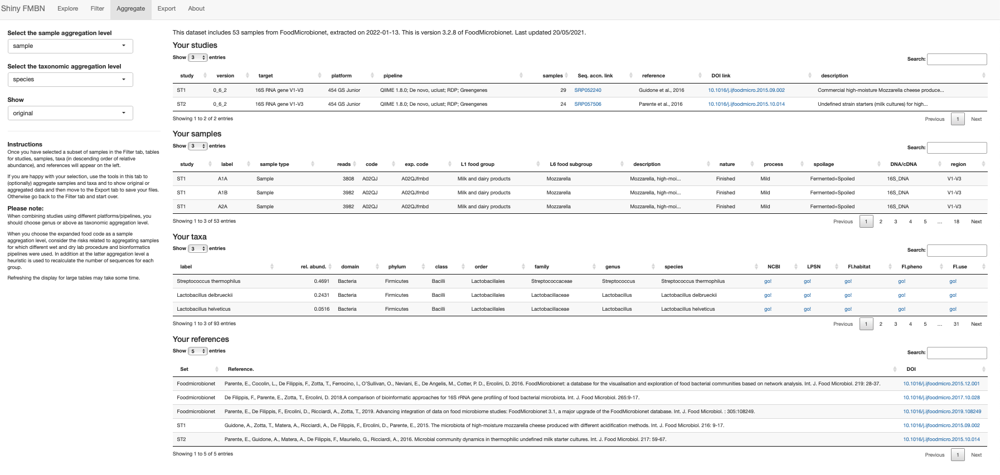

The drop-down menus on the left allows you to perform:

1. **aggregation of samples** : there are two options, **samples** and **exp. code**. Using the first, samples will not be aggregated^[in this case absolute abundance of taxa are calculated using the number of reads in the sample]; using the second, samples will be aggregated on the basis of the extended food code which includes information on the food code (from the [FoodEx2](https://www.efsa.europa.eu/it/supporting/pub/804e) classification), the nature of the sample, the process, spoilage/ fermentation and the target (DNA vs. cDNA)^[in this case absolute abundance of taxa are estimated using a heuristic rule; this should not affect further graphical or statistical analysis and is necessary to avoid inflating the weight of samples for which a larger number of reads was available.]. Please be aware that if you choose **samples**; graphical and statistical analysis may become messy or cumbersome (in case you have too many samples) while if you choose exp. code you may end up aggregating samples which were analysed using different combinations of wet and dry laboratory protocols, platforms and bioinformatic pipelines. Use the information in the study table to guide the choice of the aggregation level at this stage.  

2. **aggregation of taxa** : taxa can be aggregated at the **species** (no aggregation), **genus** , **family** or **class** level. Abundances of OTUs belonging to the same taxon are summed^[when combining data from studies using different combinations of wet laboratory protocols, target, sequencing platforms and bioinformatic pipelines, aggregation should be performed at least at the genus level. See [here](https://doi.org/10.1016/j.ijfoodmicro.2017.10.028) for details.].

Using the **Show** drop-down menu you can choose to visualize samples and taxa before or after aggregation (if any).

## **The Export tab**.

Here you will be able to export your selection in a variety of formats and generate (and export) some further summary tables and graphs of the data after aggregation. You just need to provide a prefix for the filenames and click on the action buttons. Files will be saved in different subfolders in the /output subfolder in the app. Please note that every time you click an action button a new file is saved whose name will include the file prefix, an integer (which is incremented by 1 every time you click on the action button) and a file suffix identifying the content of the file(s).
**Please note** no filtering is performed at this stage, so the output might be different from that obtained using functions for generating tables and graphs (see right panel of this tab).

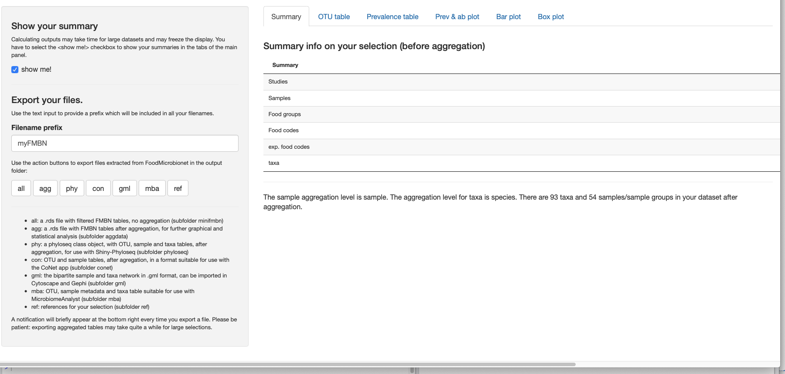

The files are saved in different formats:

1. **urFMBN** will save a list in .rds format including your selection of studies, samples, edges, taxa, and additional information on the references, version, sample Ids and sample and taxa aggregation.  

2. **aggFMBN** will save a list in .rds format including (after aggregation, if any), your selection of studies, an OTU table with absolute abundances, an OTU table with relative abundances, sample and taxa metadata, edges and node tables, an igraph object with the bipartite sample-taxa network, and additional information on the references, version, sample Ids and sample and taxa aggregation. In the future the list will be used by an interactive Shiny app for statistical and graphical analysis. This is also the file format you need for performing statistical and graphical analyses using the script [FMBNanalyzer](https://github.com/ep142/FoodMicrobionet/tree/master/FMBNanalyzer).    

3. **phyloseq** will save a phyloseq class object in .Rdata format. The object is suitable for use with [Shiny-phyloseq](http://joey711.github.io/shiny-phyloseq/)^[and a number of Bioconductor packages, including phyloseq itself but also edgeR, DESeq2 and NetCoMi.] for statistical and graphical analysis.  

4. **gml** will save the bipartite igraph object in .gml format. This format can be easily imported in either [Gephi](https://gephi.org/) or [Cytoscape](http://cytoscape.org/) for further visualization and analysis.  

5. **ref** will save the table for the references (in case you don&#39;t want to save a or b above)  

**Please note** that although a few tables and plots can generated in the app you are much better off by exporting your data and performing analyses using Microbiome Analyst, Phyloseq or FMBN analyzer.

**Default filters** .

Some taxa are removed by default (Mitochondria and Chloroplasts, other Eukaryotic sequences, taxa for which only information at the domain level is available) before any tabular or graphical result is presented.

## Graphical and tabular output.  

The **Export** tab provides a few quick graphs and tables, which can be accessed using the tabs in the right side of the window.  
**Please note**  

* a few "taxa" are removed by default (Chloroplasts, Mitochondria, Eukaryotes - for Bacteria only -, etc.)

* when you select a large number of samples with no aggregation refreshing of tables and graphs may take from several seconds to minutes.  

### **The OTU table**.

Using this tab you can visualize an OTU table for the top n taxa (100 by default) in decreasing order of relative abundance. Use the slider to select n. Please realize that no rarefaction is performed: therefore samples/studies with more sequences will have a larger influence on the results. Use the **save**; button to save the table in tab delimited format.

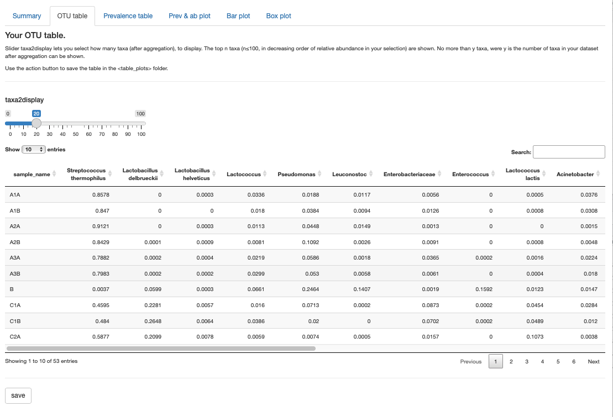  

### **The prevalence and abundance table**.

This table shows prevalence and average, minimum and maximum relative abundance for all the taxa in your dataset. As above, no rarefaction is performed. Use the **save** button to save the table in tab delimited format.

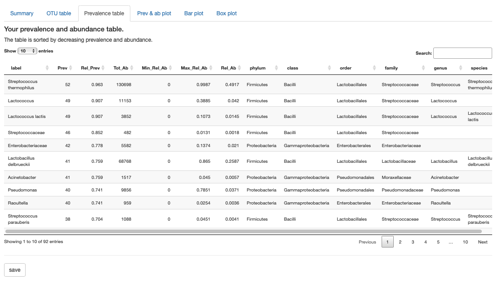  

### **The prevalence and abundance plot.**

This tab shows a prevalence and abundance plot. Minimum prevalence and abundance (initially both are set to 0) can be chosen using two sliders. The graph is recalculated and the subtitle shows the number of taxa retained at different taxonomic resolutions. The results will affect both the bar and box plot. Use the **save** button to save the graph as a 5x7 in, 150 dpi .jpg image^[type of graph, size and resolution can only be changed by changing the code, sorry (see lines 56-61 of the app).].

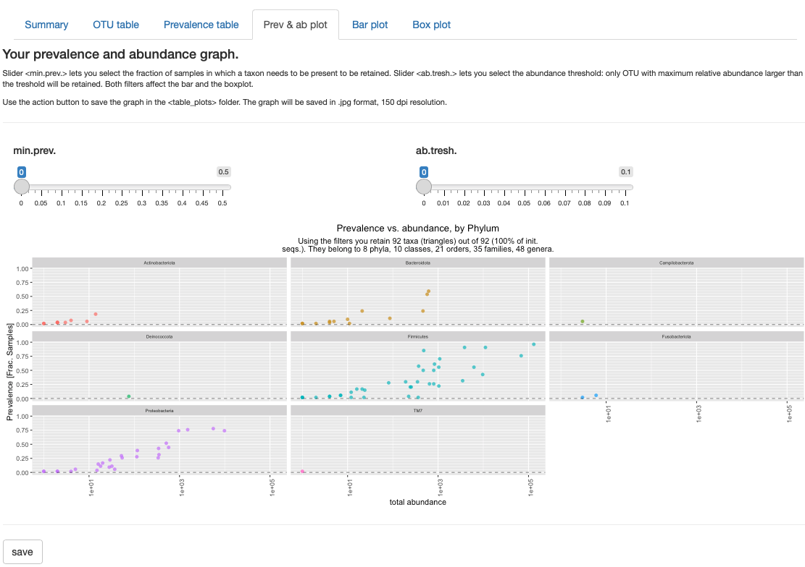  

### **The bar plot tab.**  

The bar plot tab features a stacked bar plot of abundance of the top (in terms of prevalence and/or abundance, see below) x taxa (by defauilt 25). You can choose the number of taxa to display, their taxonomic aggregation level and the sample aggregation level (both are affected by choices in the aggregate tab. The app will automatically select the aggregation level for sample/sample groups and for taxa in such a way that the lowest aggregation level compatible with showing no more than 25 samples/sample groups or taxa is selected. The two drop-down menus are generated on the fly in such a way that the use of too many taxa or samples/sample groups is prevented. If you want to select a lower taxa aggregation level you can use the filters in the prevalence and abundance graph tab (i.e. increase min. prevalence and/or abundance until the taxonomic level of your interest has less than 25 categories, this is shown in the graph subtitle). Use the **save** button to save the graph (see above for details).
**A word of caution** when choosing foodId, L1, L4, L6 for the x axis (the level of aggregation of samples in the plot) make sure you have used the filter tab in such a way that samples are uniform in terms of nature, process and spoilage/fermentation and nucleic acid target, otherwise you may be pooling very dissimilar communities, When using the exp. code you don't run this risk because this level of aggregation includes this information.

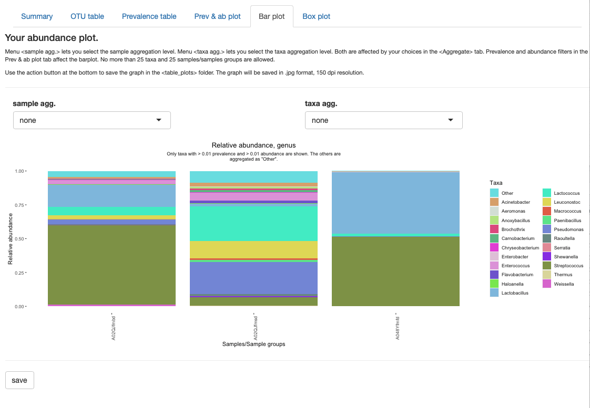  


### **The box plot tab.**

This tab features a box plot (the default, or a violin plot, selected using the plot type menu) of the relative abundance of the top most abundant 25 taxa. Choices made for sample aggregation in the bar plot tab will be reflected here, but you can use the sliders to choose the taxa aggregation level and the taxa to display^[by default all are selected; otherwise you can deselect all and add n taxa from the **select taxa** drop-down menu.]. Use the **save**; button to save the graph (see above for details). **Please note**: reactives in this tab only become active after you have visualized the bar plot.  

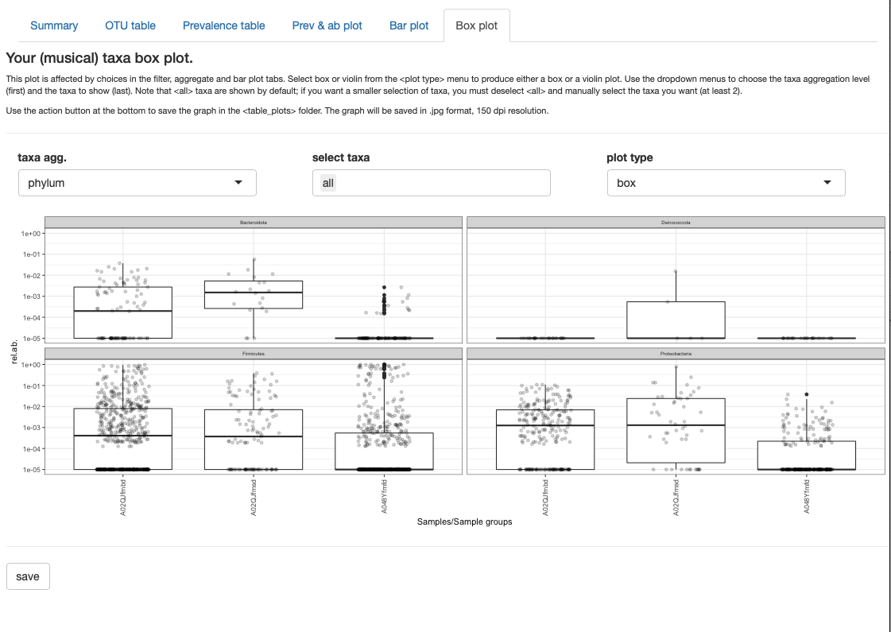

## **The Save options tab.**

Currently, this tab allows you to set the options for saving the graphs from the tabs of the Export tab (type, resolution, size). Choose a value that suits you from the drop down menus.  

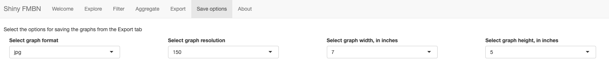

## **The About tab**.

The About tab provides information on FoodMicrobionet and the app, and displays the license (currently a MIT license).

# **Known issues**.

Because of rounding when assembling absolute abundance OTU tables it is theoretically possible that a taxon will have an abundance of 0 for all samples. This is highly unlikely, and can be fixed at a later stage.

It might have been better to add an option for rarefaction, and add some further personalization for the graphs, but I decided to leave this for later.

If you want to use external links you are better off opening the app in the browser.

# **License**.

This document is under Creative Commons Attribution-NonCommercial-ShareAlike 4.0 International ([CC BY-NC-SA 4.0](https://creativecommons.org/licenses/by-nc-sa/4.0/)) license.


## **Testing**.

Testing of the app is in progress. As of August 2024 it has been successfully tested on the following systems:

* MacBook Pro 14 inch late 2033, Apple M3, 16 Gb RAM, MacOS Sonoma 14.5, R 4.3.3, RStudio 2024.04.2+764 "Chocolate Cosmos"  for macOS 


### Acknowledgements  

This work was was carried out within the PRIN 2022 PNRR Project NCY diversity P20229JMMH and received funding from the European Union Next-GenerationEU, CUP C53D23007560001 (PIANO NAZIONALE DI RIPRESA E RESILIENZA (PNRR) – MISSIONE 4 COMPONENTE 2,  INVESTIMENTO 1.4 – D.D. 1364/2023). This script and its contents reflects only the authors’views and opinions,  neither the European Union nor the European Commission can be considered  responsible for them.